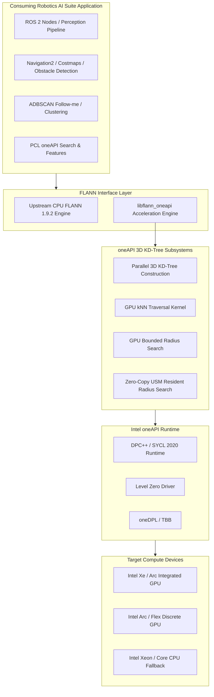

<!--
Copyright (C) 2026 Intel Corporation

SPDX-License-Identifier: Apache-2.0
-->

# Fast Library for Approximate Nearest Neighbors (FLANN) oneAPI Component

The **Fast Library for Approximate Nearest Neighbors (FLANN) oneAPI Optimized Component** (`libflann_oneapi`) delivers native Intel® oneAPI and SYCL™ 2020 acceleration for 3D KD-Tree spatial indexing, nearest-neighbor searches, and radius queries in Intel® Robotics AI Suite for autonomous mobile robots (AMRs), automated guided vehicles (AGVs), and industrial vision systems.

It provides hardware acceleration across Intel® Core™ Ultra integrated GPUs, Intel® Arc™ discrete GPUs, and Intel® Xeon® processors, significantly reducing execution latency for spatial queries in robotics perception workloads, including LiDAR-based obstacle detection, point cloud clustering (ADBSCAN/DBSCAN), normal estimation, ICP registration, and SLAM pipelines.

---

## 1. Architectural Overview

`libflann_oneapi` is engineered as a standalone acceleration add-on that coexists cleanly with standard upstream CPU FLANN distributions and downstream robotics ecosystems such as the Point Cloud Library (PCL) and ROS 2.



### Core Design Principles

1. **Native & Idiomatic SYCL 2020 and oneDPL**:
   Built strictly on modern SYCL 2020 standards and oneDPL parallel algorithms. Legacy DPCT (Intel DPC++ Compatibility Tool) runtime headers and CUDA utility shims (`cutil_math.h`, `gpu_memory_manager`) have been eliminated in favor of standardized `sycl::queue`, `sycl::nd_item`, `sycl::sub_group`, and `oneapi::dpl` execution policies.

2. **Standalone Coexistence Architecture**:
   Unlike monolithic replacements, `libflann_oneapi` installs as an independent add-on library (`libflann_oneapi.so` / `libflann_oneapi.a`). Its headers, CMake targets (`flann_oneapi::flann_oneapi`), and packaging are segregated into distinct namespaces. Applications can consume stock CPU FLANN (`flann::flann_cpp` via `libflann-dev`) and the accelerated oneAPI KD-Tree in the exact same process without symbol or header conflicts.

3. **External Queue Injection & Context Management**:
   The index exposes constructors accepting caller-owned `sycl::queue` instances (e.g. `flann::KDTreeOneAPI3dIndex(dataset, my_queue, params)`) while defaulting to a standard SYCL device queue when omitted. This grants robotics perception engines fine-grained control over:
   - Targeting specific Level Zero GPU sub-devices or compute tiles.
   - Using in-order execution queues (`sycl::property::queue::in_order`) to minimize driver dispatch barriers.
   - Overlapping asynchronous spatial index searches with sensor capture streams.

4. **Zero-Copy USM & Resident Radius Search (`radiusSearchResident`)**:
   Conventional radius search routines allocate and materialize flexible nested host containers on every invocation. The resident radius API operates on persistent, caller-owned Unified Shared Memory (USM) buffers with a bounded maximum neighborhood. Storage persists across frames, indices are remapped directly on device, and queries can specify either a uniform batch radius or an array of heterogeneous per-query radii.

5. **Strict Invariant & Safety Contracts**:
   Input point clouds and query matrices are rigorously validated at runtime:
   - Point cloud dimensions are strictly constrained to 3D spatial points (`dim == 3`).
   - Empty datasets or matrices containing non-finite (`NaN` / `Inf`) coordinates immediately throw `flann::FLANNException`.
   - Out-of-bounds or non-finite radii throw explicit exceptions rather than triggering silent GPU faults.

---

## 2. Accelerated Subsystems & Search Operations

`libflann_oneapi` accelerates core 3D nearest-neighbor query patterns through optimized GPU kernels:

| Operation | C++ API / Method | Description & Acceleration Profile |
| :--- | :--- | :--- |
| **Index Construction** | `buildIndex()` | Hierarchical 3D KD-Tree construction optimized for spatial point clouds. |
| **$k$-Nearest Neighbor** | `knnSearch()` | Parallel traversal using sub-group reductions and sorting networks for $k$-NN queries. |
| **Radius Search** | `radiusSearch()` | Bounded spherical neighbor discovery with CSR row split or count matrices. |
| **Resident Radius** | `radiusSearchResident()` | Zero-allocation USM resident search for high-frequency perception and clustering loops. |

### Distance Metrics

The oneAPI 3D KD-Tree supports standardized FLANN distance functors:
- `flann::L2<float>`: Euclidean $L_2$ distance (expects and reports squared distance $r^2$).
- `flann::L1<float>`: Manhattan $L_1$ distance.

---

## 3. Package Installation & Setup

`libflann_oneapi` packages are distributed through the Intel® Robotics AI Suite package repositories.

### Supported Environments
- **Ubuntu 24.04 LTS (Noble)** / ROS 2 Jazzy
- **Ubuntu 22.04 LTS (Jammy)** / ROS 2 Humble
- **Fedora 44**
- **Intel® oneAPI Toolkit**: 2026.1 or newer

### Repository Configuration

::::{tab-set}
:::{tab-item} **Ubuntu (APT)**
:sync: ubuntu

```bash
# Add Intel oneAPI repository
curl -fsSL https://apt.repos.intel.com/intel-gpg-keys/GPG-PUB-KEY-INTEL-SW-PRODUCTS.PUB \
  | sudo gpg --dearmor -o /usr/share/keyrings/oneapi-archive-keyring.gpg
echo "deb [signed-by=/usr/share/keyrings/oneapi-archive-keyring.gpg] https://apt.repos.intel.com/oneapi all main" \
  | sudo tee /etc/apt/sources.list.d/oneAPI.list

# Add Intel Robotics AI Suite APT repository
echo "deb [trusted=yes] https://wheeljack.ch.intel.com/apt-repos/AMR/$(lsb_release -cs) amr main" \
  | sudo tee /etc/apt/sources.list.d/intel-robotics-ai-suite.list

sudo apt-get update
```

:::
:::{tab-item} **Fedora (DNF)**
:sync: fedora

```bash
# Add Intel oneAPI repository
sudo tee /etc/yum.repos.d/oneAPI.repo << 'EOF'
[oneAPI]
name=Intel® oneAPI repository
baseurl=https://yum.repos.intel.com/oneapi
enabled=1
gpgcheck=1
repo_gpgcheck=1
gpgkey=https://yum.repos.intel.com/intel-gpg-keys/GPG-PUB-KEY-INTEL-SW-PRODUCTS.PUB
EOF

sudo dnf check-update
```

:::
::::

### Installing Packages

#### Development Environment
For compiling downstream robotics applications or custom perception nodes with oneAPI acceleration, install the DPC++ compiler toolchain, parallel runtime libraries, and the development package:

::::{tab-set}
:::{tab-item} **Ubuntu 24.04 (Jazzy)**
:sync: jazzy

```bash
sudo apt-get install -y \
  intel-oneapi-compiler-dpcpp-cpp-2026.1 \
  intel-oneapi-libdpstd-devel \
  intel-oneapi-tbb-devel-2023.1 \
  libflann-dev \
  libflann-oneapi-dev
```

:::
:::{tab-item} **Ubuntu 22.04 (Humble)**
:sync: humble

```bash
sudo apt-get install -y \
  intel-oneapi-compiler-dpcpp-cpp-2026.1 \
  intel-oneapi-libdpstd-devel \
  intel-oneapi-tbb-devel-2023.1 \
  libflann-dev \
  libflann-oneapi-dev
```

:::
:::{tab-item} **Fedora 44**
:sync: fedora

```bash
sudo dnf install -y \
  intel-oneapi-compiler-dpcpp-cpp-2026.1 \
  intel-oneapi-libdpstd-devel \
  intel-oneapi-tbb-devel-2023.1 \
  flann-devel \
  flann-oneapi-devel
```

:::
::::

#### Production / Robot Deployment
In production environments (e.g. onboard mobile robots or minimal container images) where code is executed without recompilation, install only the runtime library package:

::::{tab-set}
:::{tab-item} **Ubuntu (DEB)**
:sync: ubuntu

```bash
sudo apt-get install -y libflann-oneapi1.9
```

:::
:::{tab-item} **Fedora (RPM)**
:sync: fedora

```bash
sudo dnf install -y flann-oneapi
```

:::
::::

---

## 4. Consuming Application Integration Guide

Downstream robotics applications (such as standalone C++ spatial search nodes, point cloud filters, or ROS 2 perception packages) integrate `libflann_oneapi` using standard modern CMake exports.

### Step 1: CMake Configuration

In the downstream application `CMakeLists.txt`:

```cmake
cmake_minimum_required(VERSION 3.25)
project(robotics_spatial_indexing LANGUAGES CXX)

set(CMAKE_CXX_STANDARD 17)
set(CMAKE_CXX_STANDARD_REQUIRED ON)

# Find upstream CPU FLANN (if CPU indexing is also needed)
find_package(flann CONFIG REQUIRED)

# Find oneAPI FLANN acceleration package
find_package(FlannOneAPI CONFIG REQUIRED)

add_executable(spatial_search_node src/main.cpp)

# Enable SYCL compiler flags for Intel icpx
target_compile_options(spatial_search_node PRIVATE
  -fsycl
  -fsycl-unnamed-lambda
  -fsycl-device-code-split=per_kernel
)
target_link_options(spatial_search_node PRIVATE -fsycl)

# Link against the accelerated oneAPI target
target_link_libraries(spatial_search_node PRIVATE
  flann_oneapi::flann_oneapi
  # flann_oneapi::flann_oneapi_static  # Alternatively, link static archive
)
```

### Step 2: Building the Application

Applications utilizing SYCL device kernels must be compiled using Intel's oneAPI C++ Compiler (`icpx`).

#### Standalone CMake Project Build:
```bash
# 1. Initialize oneAPI environment
source /opt/intel/oneapi/setvars.sh --force

# 2. Configure build with icpx
cmake -S . -B build -G Ninja \
  -DCMAKE_CXX_COMPILER=icpx \
  -DCMAKE_BUILD_TYPE=RelWithDebInfo

# 3. Build executable
cmake --build build --parallel
```

#### ROS 2 / Colcon Workspace Build:
For ROS 2 packages inside a colcon workspace:
```bash
source /opt/intel/oneapi/setvars.sh --force
source /opt/ros/$ROS_DISTRO/setup.bash

colcon build \
  --packages-select spatial_search_node \
  --cmake-args \
    -DCMAKE_CXX_COMPILER=icpx \
    -DCMAKE_BUILD_TYPE=RelWithDebInfo
```

---

## 5. C++ Code Examples

### Include Paths and Namespaces

```cpp
#include <flann/algorithms/dist.h>
#include <flann/algorithms/dpcpp/kdtree_dpcpp_3d_index.h>
#include <flann/algorithms/dpcpp/kdtree_dpcpp_3d_index_params.h>
#include <sycl/sycl.hpp>
```

### Device Queue Management: Automatic vs. Caller-Owned Queue

1. **Automatic Device Management (Zero Boilerplate)**:
   When constructed without a queue parameter, `flann::KDTreeOneAPI3dIndex` initializes an internal device queue targeting the default SYCL device.
2. **Caller-Owned Queue Injection (`sycl::queue&`)**:
   Downstream applications can supply their own persistent queue (e.g., an in-order queue targeting a specific Level Zero sub-device) to interleave GPU computations with sensor frame ingestion.

### Example 1: Accelerated 3D KD-Tree Build and $k$-NN Search

The following example builds a 3D KD-Tree on GPU and queries the nearest neighbors for a batch of query coordinates:

```cpp
#include <iostream>
#include <vector>
#include <flann/algorithms/dist.h>
#include <flann/algorithms/dpcpp/kdtree_dpcpp_3d_index.h>
#include <flann/algorithms/dpcpp/kdtree_dpcpp_3d_index_params.h>
#include <sycl/sycl.hpp>

int main()
{
    // 1. Initialize an in-order SYCL GPU queue
    sycl::queue q(sycl::gpu_selector_v, sycl::property::queue::in_order{});
    std::cout << "Using device: "
              << q.get_device().get_info<sycl::info::device::name>() << std::endl;

    // 2. Synthesize 3D point cloud dataset (e.g. 100,000 points)
    const size_t num_points = 100000;
    std::vector<float> dataset_points(num_points * 3);
    for (size_t i = 0; i < dataset_points.size(); ++i) {
        dataset_points[i] = static_cast<float>(rand()) / RAND_MAX * 50.0f;
    }
    flann::Matrix<float> dataset(dataset_points.data(), num_points, 3);

    // 3. Construct and build the oneAPI 3D KD-Tree index
    using OneAPIIndex = flann::KDTreeOneAPI3dIndex<flann::L2<float>>;
    OneAPIIndex index(dataset, q, flann::KDTreeOneAPI3dIndexParams());
    index.buildIndex();

    // 4. Prepare batch query (4,096 points, k = 8 neighbors)
    const size_t num_queries = 4096;
    const size_t k = 8;
    std::vector<float> query_points(num_queries * 3);
    for (size_t i = 0; i < query_points.size(); ++i) {
        query_points[i] = static_cast<float>(rand()) / RAND_MAX * 50.0f;
    }
    flann::Matrix<float> queries(query_points.data(), num_queries, 3);

    std::vector<int> indices(num_queries * k);
    std::vector<float> distances(num_queries * k);
    flann::Matrix<int> indices_mat(indices.data(), num_queries, k);
    flann::Matrix<float> dists_mat(distances.data(), num_queries, k);

    // 5. Execute parallel GPU kNN search
    flann::SearchParams params;
    index.knnSearch(queries, indices_mat, dists_mat, k, params);

    std::cout << "Successfully searched " << num_queries
              << " queries with k = " << k << std::endl;
    return 0;
}
```

### Example 2: Accelerated Bounded Radius Search

Standard radius search queries all points lying within distance $r$ (or squared distance $r^2$ for $L_2$):

```cpp
#include <iostream>
#include <vector>
#include <flann/algorithms/dist.h>
#include <flann/algorithms/dpcpp/kdtree_dpcpp_3d_index.h>
#include <flann/algorithms/dpcpp/kdtree_dpcpp_3d_index_params.h>

void runRadiusSearch(flann::KDTreeOneAPI3dIndex<flann::L2<float>>& index,
                     const flann::Matrix<float>& queries,
                     float radius_squared)
{
    // Pass 1: Count total neighbors to allocate contiguous output matrices
    int dummy_idx = 0;
    float dummy_dist = 0.0f;
    int dummy_split = 0;
    flann::Matrix<int> unused_indices(&dummy_idx, 0, 1);
    flann::Matrix<float> unused_dists(&dummy_dist, 0, 1);
    flann::Matrix<int> unused_splits(&dummy_split, 0, 1);

    flann::SearchParams count_params;
    count_params.max_neighbors = 0; // Request neighbor count only
    int total_neighbors = index.radiusSearch(
        queries, unused_indices, unused_dists, unused_splits, radius_squared, count_params);

    if (total_neighbors <= 0) {
        std::cout << "No neighbors found within radius." << std::endl;
        return;
    }

    // Pass 2: Extract indices and CSR row split boundaries
    std::vector<int> indices(total_neighbors);
    std::vector<float> dists(total_neighbors);
    std::vector<int> row_splits(queries.rows + 1);

    flann::Matrix<int> indices_mat(indices.data(), total_neighbors, 1);
    flann::Matrix<float> dists_mat(dists.data(), total_neighbors, 1);
    flann::Matrix<int> splits_mat(row_splits.data(), row_splits.size(), 1);

    flann::SearchParams search_params;
    search_params.max_neighbors = -1;
    index.radiusSearch(queries, indices_mat, dists_mat, splits_mat,
                       radius_squared, search_params);

    std::cout << "Discovered " << total_neighbors << " neighbors across "
              << queries.rows << " query points." << std::endl;
}
```

### Example 3: Zero-Copy USM Resident Radius Search (`radiusSearchResident`)

For tight robotics loops (e.g. DBSCAN clustering, Euclidean cluster extraction, or real-time LiDAR segmentation), `radiusSearchResident` eliminates per-frame heap allocations by keeping query, result, and count buffers pinned in Unified Shared Memory (USM):

```cpp
#include <iostream>
#include <vector>
#include <flann/algorithms/dist.h>
#include <flann/algorithms/dpcpp/kdtree_dpcpp_3d_index.h>
#include <sycl/sycl.hpp>

int main()
{
    sycl::queue q(sycl::gpu_selector_v, sycl::property::queue::in_order{});

    const size_t num_points = 50000;
    std::vector<float> points(num_points * 3, 1.0f);
    flann::Matrix<float> dataset(points.data(), num_points, 3);

    flann::KDTreeOneAPI3dIndex<flann::L2<float>> index(dataset, q);
    index.buildIndex();

    // Bounded resident parameters
    const size_t max_queries = 2048;
    const size_t max_neighbors_per_query = 64;
    const float search_radius_sq = 2.25f; // (1.5 m)^2

    // Pre-allocate persistent USM shared memory once at pipeline initialization
    float* usm_queries = sycl::malloc_shared<float>(max_queries * 3, q);
    int* usm_indices = sycl::malloc_shared<int>(max_queries * max_neighbors_per_query, q);
    int* usm_counts = sycl::malloc_shared<int>(max_queries, q);
    float* usm_scratch = sycl::malloc_shared<float>(max_queries * max_neighbors_per_query, q);

    flann::Matrix<float> query_mat(usm_queries, max_queries, 3);
    flann::Matrix<int> index_mat(usm_indices, max_queries, max_neighbors_per_query);
    flann::Matrix<int> count_mat(usm_counts, max_queries, 1);
    flann::Matrix<float> scratch_mat(usm_scratch, max_queries, max_neighbors_per_query);

    flann::SearchParams params;
    params.max_neighbors = static_cast<int>(max_neighbors_per_query);
    params.matrices_in_gpu_ram = true; // Memory is resident on device

    // High-rate perception loop (e.g., 30 Hz LiDAR frame callback)
    for (int frame = 0; frame < 10; ++frame) {
        // ... Populate usm_queries directly without host-device transfer ...

        int total_valid = index.radiusSearchResident(
            query_mat, index_mat, count_mat, scratch_mat, search_radius_sq, params);

        // Process neighbor indices in-place: for query row r, valid neighbors
        // are located at usm_indices[r * max_neighbors_per_query .. + count_mat[r]]
    }

    // Free resident USM allocations at pipeline shutdown
    sycl::free(usm_queries, q);
    sycl::free(usm_indices, q);
    sycl::free(usm_counts, q);
    sycl::free(usm_scratch, q);

    return 0;
}
```

---

## 6. Runtime Device Selection and Verification

Applications using `libflann_oneapi` dynamically select the target compute hardware via oneAPI standard environment variables without code modification:

| Target Device | Runtime Variable Setting |
| :--- | :--- |
| **Intel Arc Discrete GPU** | `export ONEAPI_DEVICE_SELECTOR=level_zero:gpu` |
| **Intel Core Integrated GPU** | `export ONEAPI_DEVICE_SELECTOR=level_zero:gpu` |
| **Specific Sub-Device / Tile** | `export ONEAPI_DEVICE_SELECTOR="level_zero:0.0"` |
| **Intel Xeon CPU Fallback** | `export ONEAPI_DEVICE_SELECTOR=opencl:cpu` |

### Device Discovery Verification

Confirm that the Level Zero GPU driver and SYCL runtime correctly discover hardware accelerators:

```bash
sycl-ls
```

Expected output example:
```text
[opencl:cpu] Intel(R) OpenCL, 13th Gen Intel(R) Core(TM) i9-13900K
[ext_oneapi_level_zero:gpu] Intel(R) Level-Zero, Intel(R) Arc(TM) A770 Graphics
[ext_oneapi_level_zero:gpu] Intel(R) Level-Zero, Intel(R) Graphics [0x7d55]
```

---

## 7. Benchmarking and Performance Insights

Extensive benchmark suites validate the oneAPI 3D KD-Tree against upstream CPU FLANN on Intel Iris® Xe and Intel Arc™ platforms.

### Workload Crossover Analysis

GPU kernel dispatch and memory transfers introduce a baseline latency overhead. For small point clouds ($< 10{,}000$ points) or very small query batches ($< 1{,}024$ queries), upstream CPU FLANN is highly efficient. When scaling to dense LiDAR clouds ($100{,}000+$ points) and large query batches ($16{,}000$ to $64{,}000$), `libflann_oneapi` delivers significant speedups.

The following data summarizes Google Benchmark 1.9.5 measurements on a 100K-point crossover workload comparing CPU FLANN to `libflann_oneapi` (median wall-clock time in milliseconds):

| Batch Queries | Neighbors ($k$) | Upstream CPU FLANN (ms) | FLANN oneAPI GPU (ms) | Measured Speedup |
| :---: | :---: | :---: | :---: | :---: |
| **16,384** | $1$ | 9.389 ms | 8.096 ms | **1.16x** |
| **16,384** | $8$ | 21.859 ms | 15.623 ms | **1.40x** |
| **16,384** | $32$ | 58.246 ms | 42.840 ms | **1.36x** |
| **65,536** | $1$ | 42.852 ms | 23.635 ms | **1.81x** |
| **65,536** | $8$ | 99.378 ms | 60.425 ms | **1.64x** |
| **65,536** | $32$ | 230.066 ms | 132.764 ms | **1.73x** |

---

## 8. Performance Best Practices

1. **Queue Warm-Up and In-Order Queues**:
   Always initialize persistent `sycl::queue` instances at system startup using `sycl::property::queue::in_order{}`. Constructing queues per-frame causes JIT driver synchronization and context creation overhead.

2. **Batch Query Amortization**:
   To maximize GPU compute occupancy, aggregate query points into batches of at least $4{,}096$ (ideally $16{,}000+$) points rather than issuing individual or single-point queries.

3. **Unified Shared Memory on Integrated GPUs**:
   On Intel Core Ultra and Xe processors, host CPU and integrated GPU share physical system RAM. Utilizing USM shared memory (`sycl::malloc_shared`) with `radiusSearchResident` eliminates PCIe transfer overhead entirely.

4. **Thread Safety and Queue Sharing**:
   A single `sycl::queue` can be shared across multiple threads, but individual index objects and `flann::Matrix` containers must be protected from concurrent unsynchronized writes.

---

## 9. Troubleshooting

- **Level Zero GPU Device Access**:
  Ensure the active user belongs to the `render` or `video` groups to access `/dev/dri/renderD128`:
  ```bash
  sudo usermod -aG render,video $USER
  ```

- **CPU Affinity on Hybrid P/E-Core Processors**:
  On 12th/13th/14th Gen Intel Core and Core Ultra processors, Linux kernel thread scheduling may assign host dispatch threads to Efficient cores (E-cores). To maximize GPU dispatch throughput, bind the host perception process to Performance cores (P-cores) using `taskset`:
  ```bash
  taskset -c 0-3 ros2 run my_pkg my_node
  ```

- **Non-Finite Coordinate Exceptions**:
  LiDAR and depth cameras occasionally emit `NaN` or `Inf` points on beam dropouts. Filter out invalid returns (e.g. using `pcl::removeNaNFromPointCloud` or `pcl_oneapi_filters`) before passing datasets to `buildIndex()`, as `flann::FLANNException` is thrown on non-finite coordinates.
