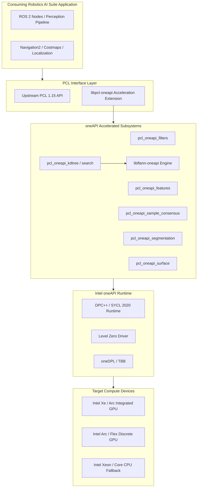

<!--
Copyright (C) 2026 Intel Corporation

SPDX-License-Identifier: Apache-2.0
-->

# Point Cloud Library (PCL) oneAPI Component

{bdg-primary}`PCL 1.15` {bdg-info}`oneAPI 2026.1+` {bdg-secondary}`SYCL 2020` {bdg-success}`Level Zero`

The **Point Cloud Library (PCL) oneAPI Optimized Component** (`libpcl-oneapi`) delivers native Intel® oneAPI and SYCL™ 2020 acceleration for 3D point cloud and LiDAR processing pipelines in Intel® Robotics AI Suite for autonomous mobile robots (AMRs), automated guided vehicles (AGVs), and industrial vision systems.

It provides hardware acceleration across Intel® Core™ Ultra integrated GPUs, Intel® Arc™ discrete GPUs, and Intel® Xeon® processors, significantly reducing execution latency for perception tasks such as filtering, spatial indexing, feature extraction, surface reconstruction, and object segmentation.

---

## 1. Architectural Overview

`libpcl-oneapi` is engineered as a modular acceleration layer that pairs with standard PCL architectures and the Intel® Robotics AI Suite ecosystem.



### Core Design Principles

::::{grid} 1 2 2 2
:gutter: 3

:::{grid-item-card} **Native SYCL 2020 & oneDPL**
Built cleanly on modern SYCL 2020 standards and oneDPL parallel algorithms. All kernels use standardized `sycl::queue`, `sycl::nd_item`, `sycl::sub_group`, and `oneapi::dpl` execution policies for portable, high-performance hardware execution across Intel GPUs and CPUs.
:::

:::{grid-item-card} **Dual-Mode Deployment Flexibility**
- **Standalone Extension Mode (`PCL_ONEAPI_EXTENSION_ONLY=ON`)**: Installs exclusively the accelerated extension libraries and headers against an existing distribution or ROS PCL installation (`libpcl-dev`).
- **Full Integrated PCL Build (`BUILD_ONEAPI=ON`)**: Provides a complete, unified PCL 1.15 distribution compiled end-to-end with Intel oneAPI compilers.
:::

:::{grid-item-card} **External Queue Injection & Context Management**
All accelerated modules expose `.setQueue(sycl::queue&)` methods accepting caller-owned `sycl::queue` instances (or automatically fall back to `pcl::oneapi::getDefaultQueue()`). Enables targeting specific GPU sub-devices, in-order queues, and overlapping asynchronous compute with sensor acquisition.
:::

:::{grid-item-card} **Zero-Copy Unified Shared Memory (USM)**
Supports persistent USM buffer reuse across frames. Continuous perception loops avoid host-to-device allocation thrashing by reusing pre-allocated device memory for repeated point cloud traversals.
:::

:::{grid-item-card} **Tight Integration with `libflann-oneapi`**
High-dimensional and 3D spatial queries in `pcl_oneapi_kdtree` and `pcl_oneapi_search` delegate to `libflann-oneapi` (v1.9.2-oneAPI), delivering GPU-resident nearest neighbor searches.
:::
::::

---

## 2. Accelerated Subsystems

`libpcl-oneapi` organizes hardware acceleration into modular shared libraries:

| Library Target | Subsystem | Description & Acceleration Capabilities |
| :--- | :--- | :--- |
| `pcl_oneapi_common` | Common / Runtime | Device selection, queue management (`sycl_queue.h`), and memory primitives. |
| `pcl_oneapi_kdtree` | Spatial Indexing | 3D KD-Tree search accelerated via Level Zero and `libflann-oneapi`. |
| `pcl_oneapi_search` | Search Dispatcher | Unified search interface for nearest-neighbor and radius queries. |
| `pcl_oneapi_octree` | Octree Search | Hierarchical octree construction, spatial voxel search, and change detection. |
| `pcl_oneapi_features` | Feature Estimation | Surface normal estimation with parallel sub-group warp reductions. |
| `pcl_oneapi_filters` | Filtering | PassThrough, VoxelGrid, and StatisticalOutlierRemoval (SOR) downsampling. |
| `pcl_oneapi_registration` | Alignment & ICP | Iterative Closest Point (ICP), SAC-IA, and correspondence estimation. |
| `pcl_oneapi_sample_consensus` | Model Fitting | Parallel RANSAC and M-estimator plane, line, and cylinder model fitting. |
| `pcl_oneapi_segmentation` | Segmentation | Parallel sample consensus segmentation and Euclidean cluster extraction. |
| `pcl_oneapi_surface` / `_omp` | Reconstruction | Moving Least Squares (MLS) surface smoothing and Greedy Projection mesh meshing. |

---

## 3. Package Installation & Setup

`libpcl-oneapi` packages are distributed through the Intel® Robotics AI Suite APT package repositories.

### Supported Environments
- **Ubuntu 24.04 LTS (Noble)** / ROS 2 Jazzy
- **Ubuntu 22.04 LTS (Jammy)** / ROS 2 Humble
- **Intel® oneAPI Toolkit**: 2026.1 or newer

### APT Repository Configuration

```bash
# Add Intel oneAPI repository
curl -fsSL https://apt.repos.intel.com/intel-gpg-keys/GPG-PUB-KEY-INTEL-SW-PRODUCTS.PUB \
  | sudo gpg --dearmor -o /usr/share/keyrings/oneapi-archive-keyring.gpg
echo "deb [signed-by=/usr/share/keyrings/oneapi-archive-keyring.gpg] https://apt.repos.intel.com/oneapi all main" \
  | sudo tee /etc/apt/sources.list.d/oneAPI.list

# Add Intel Robotics AI Suite APT repository
echo "deb [trusted=yes] https://wheeljack.ch.intel.com/apt-repos/AMR/$(lsb_release -cs) amr main" \
  | sudo tee /etc/apt/sources.list.d/intel-robotics-ai-suite.list

sudo apt-get update
```

### Installing Packages

#### Development Environment
For building downstream robotics perception pipelines with oneAPI acceleration, install the compiler toolchain, peer FLANN acceleration library, and the `libpcl-oneapi-dev` development package (which automatically pulls `libpcl-dev` along with all required base and accelerated headers):

:::::{tab-set}
::::{tab-item} **Ubuntu 24.04 (Jazzy)**
:sync: jazzy

```bash
sudo apt-get install -y \
  intel-oneapi-compiler-dpcpp-cpp-2026.1 \
  intel-oneapi-libdpstd-devel \
  intel-oneapi-tbb-devel-2023.1 \
  libflann-oneapi-dev \
  libpcl-oneapi-dev
```

::::
::::{tab-item} **Ubuntu 22.04 (Humble)**
:sync: humble

```bash
sudo apt-get install -y \
  intel-oneapi-compiler-dpcpp-cpp-2026.1 \
  intel-oneapi-libdpstd-devel \
  intel-oneapi-tbb-devel-2023.1 \
  libflann-oneapi-dev \
  libpcl-oneapi-dev
```

::::
:::::

#### Production / Robot Deployment
In deployment environments (such as onboard autonomous mobile robots or production container images) where code is executed without recompilation, install only the runtime libraries to minimize image footprint:

:::::{tab-set}
::::{tab-item} **Complete oneAPI Runtime**
Install the full PCL acceleration runtime suite (including GPU drivers and runtime dependencies):

```bash
sudo apt-get install -y libpcl-oneapi
```

::::
::::{tab-item} **Modular Runtime (Minimal Footprint)**
Install only the specific accelerated subsystems required by your application (for example, filtering and segmentation):

```bash
sudo apt-get install -y \
  libpcl-oneapi-filters1.15 \
  libpcl-oneapi-segmentation1.15
```

::::
:::::

---

## 4. Consuming Application Integration Guide

Consuming applications (such as ROS 2 perception nodes or standalone C++ robotics pipelines) integrate `libpcl-oneapi` using standard CMake target definitions.

### Step 1: CMake Configuration

In the downstream application `CMakeLists.txt`:

```cmake
cmake_minimum_required(VERSION 3.25)
project(robotics_pointcloud_filter LANGUAGES CXX)

set(CMAKE_CXX_STANDARD 17)
set(CMAKE_CXX_STANDARD_REQUIRED ON)

# Find upstream PCL components
find_package(PCL CONFIG REQUIRED COMPONENTS common io)

# Find oneAPI PCL acceleration components
find_package(PCL-ONEAPI CONFIG REQUIRED COMPONENTS
  oneapi_common
  oneapi_filters
  oneapi_features
  oneapi_kdtree
  oneapi_segmentation
)

add_executable(robotics_perception_node src/main.cpp)

# Enable SYCL compiler flags for Intel icpx
target_compile_options(robotics_perception_node PRIVATE
  -fsycl
  -fsycl-unnamed-lambda
  -fsycl-device-code-split=per_kernel
)
target_link_options(robotics_perception_node PRIVATE -fsycl)

target_link_libraries(robotics_perception_node PRIVATE
  ${PCL_LIBRARIES}
  ${PCL-ONEAPI_LIBRARIES}
  # Alternatively, link specific components:
  # pcl_oneapi_common
  # pcl_oneapi_filters
)
```

### Step 2: Building the Downstream Application

:::{important}
Because SYCL acceleration utilizes device compilation models, applications must be compiled using Intel's oneAPI C++ Compiler (`icpx`).
:::

:::::{tab-set}
::::{tab-item} **Standalone CMake Project**

```bash
# 1. Initialize oneAPI environment
source /opt/intel/oneapi/setvars.sh

# 2. Configure with icpx
cmake -S . -B build -G Ninja \
  -DCMAKE_CXX_COMPILER=icpx \
  -DCMAKE_BUILD_TYPE=RelWithDebInfo

# 3. Build executable
cmake --build build --parallel
```

::::
::::{tab-item} **ROS 2 / Colcon Workspace**

```bash
# 1. Initialize oneAPI and ROS environments
source /opt/intel/oneapi/setvars.sh
source /opt/ros/$ROS_DISTRO/setup.bash

# 2. Build ROS 2 package using icpx
colcon build \
  --packages-select robotics_perception_node \
  --cmake-args \
    -DCMAKE_CXX_COMPILER=icpx \
    -DCMAKE_BUILD_TYPE=RelWithDebInfo
```

::::
:::::

### Step 3: C++ Code Examples

#### Device Queue Management: Automatic vs. Caller-Owned Queue

:::{tip}
`libpcl-oneapi` supports two execution models:

1. **Automatic Device Management (Zero Boilerplate)**:
   Calling `.setQueue()` is optional. When omitted, all algorithms automatically fall back to `pcl::oneapi::getDefaultQueue()`. This default singleton queue queries the SYCL default selector and targets whatever device is configured in the environment (e.g., via `ONEAPI_DEVICE_SELECTOR=level_zero:gpu`). It also utilizes an internal device memory pool to minimize allocation overhead.
2. **Caller-Owned Queue Injection (`.setQueue(sycl::queue&)` )**:
   Downstream applications can supply their own `sycl::queue` to target specific GPU sub-devices, enforce in-order execution (`sycl::property::queue::in_order`), or interleave asynchronous compute with sensor acquisition. Note: `PointCloudDev<T>` instances and algorithms operating on them must share the same `sycl::context`.
:::

#### Example 1: Accelerated Real-Time PassThrough & VoxelGrid Downsampling

:::::{tab-set}
::::{tab-item} **Approach A: Automatic Default Queue (Zero Boilerplate)**

```cpp
#include <iostream>
#include <memory>
#include <pcl/point_cloud.h>
#include <pcl/point_types.h>
#include <pcl/oneapi/filters/passthrough.h>
#include <pcl/oneapi/filters/voxel_grid.h>

int main()
{
    auto input_cloud = std::make_shared<pcl::PointCloud<pcl::PointXYZ>>();
    // ... populate input_cloud ...

    // No SYCL boilerplate or queue management needed:
    // Uses pcl::oneapi::getDefaultQueue() automatically.
    auto z_filtered = std::make_shared<pcl::PointCloud<pcl::PointXYZ>>();
    pcl::oneapi::PassThrough<pcl::PointXYZ> pass;
    pass.setInputCloud(input_cloud);
    pass.setFilterFieldName("z");
    pass.setFilterLimits(0.2f, 1.8f);
    pass.filter(*z_filtered);

    auto voxel_filtered = std::make_shared<pcl::PointCloud<pcl::PointXYZ>>();
    pcl::oneapi::VoxelGrid<pcl::PointXYZ> voxel;
    voxel.setInputCloud(z_filtered);
    voxel.setLeafSize(0.05f, 0.05f, 0.05f);
    voxel.filter(*voxel_filtered);

    return 0;
}
```

::::
::::{tab-item} **Approach B: Caller-Owned In-Order Queue Injection**

```cpp
#include <iostream>
#include <memory>
#include <sycl/sycl.hpp>
#include <pcl/point_cloud.h>
#include <pcl/point_types.h>
#include <pcl/oneapi/filters/passthrough.h>
#include <pcl/oneapi/filters/voxel_grid.h>

int main()
{
    // 1. Initialize an in-order GPU queue targeting the Intel GPU
    sycl::queue q(sycl::gpu_selector_v, sycl::property::queue::in_order{});
    std::cout << "Running on device: "
              << q.get_device().get_info<sycl::info::device::name>() << std::endl;

    // 2. Allocate and generate input cloud (e.g. from 3D LiDAR)
    auto input_cloud = std::make_shared<pcl::PointCloud<pcl::PointXYZ>>();
    input_cloud->width = 100000;
    input_cloud->height = 1;
    input_cloud->points.resize(input_cloud->width * input_cloud->height);
    for (size_t i = 0; i < input_cloud->size(); ++i) {
        (*input_cloud)[i] = pcl::PointXYZ(
            static_cast<float>(rand()) / RAND_MAX * 10.0f,
            static_cast<float>(rand()) / RAND_MAX * 10.0f,
            static_cast<float>(rand()) / RAND_MAX * 2.0f);
    }

    // 3. Stage 1: GPU-accelerated PassThrough Z-filtering with injected queue
    auto z_filtered = std::make_shared<pcl::PointCloud<pcl::PointXYZ>>();
    pcl::oneapi::PassThrough<pcl::PointXYZ> pass;
    pass.setQueue(q);
    pass.setInputCloud(input_cloud);
    pass.setFilterFieldName("z");
    pass.setFilterLimits(0.2f, 1.8f);
    pass.filter(*z_filtered);

    // 4. Stage 2: GPU-accelerated VoxelGrid Leaf Downsampling with injected queue
    auto voxel_filtered = std::make_shared<pcl::PointCloud<pcl::PointXYZ>>();
    pcl::oneapi::VoxelGrid<pcl::PointXYZ> voxel;
    voxel.setQueue(q);
    voxel.setInputCloud(z_filtered);
    voxel.setLeafSize(0.05f, 0.05f, 0.05f);
    voxel.filter(*voxel_filtered);

    std::cout << "Original points: " << input_cloud->size()
              << " -> Downsampled points: " << voxel_filtered->size() << std::endl;

    return 0;
}
```

::::
:::::

#### Example 2: GPU Accelerated Surface Normal Estimation

```cpp
#include <sycl/sycl.hpp>
#include <pcl/point_cloud.h>
#include <pcl/point_types.h>
#include <pcl/oneapi/features/normal_3d.h>
#include <pcl/oneapi/search/kdtree.h>

void estimateNormals(const pcl::PointCloud<pcl::PointXYZ>::Ptr& cloud,
                     pcl::PointCloud<pcl::Normal>::Ptr& output_normals,
                     sycl::queue& q)
{
    // Accelerated search tree backend
    auto tree = std::make_shared<pcl::oneapi::search::KdTree<pcl::PointXYZ>>();
    tree->setQueue(q);

    // GPU Normal Estimation with warp reduction kernels
    pcl::oneapi::NormalEstimation<pcl::PointXYZ, pcl::Normal> ne;
    ne.setQueue(q);
    ne.setInputCloud(cloud);
    ne.setSearchMethod(tree);
    ne.setRadiusSearch(0.15); // 15 cm neighborhood
    ne.compute(*output_normals);
}
```

#### Example 3: RANSAC Ground Plane Segmentation

```cpp
#include <sycl/sycl.hpp>
#include <pcl/ModelCoefficients.h>
#include <pcl/PointIndices.h>
#include <pcl/oneapi/segmentation/sac_segmentation.h>

void extractGroundPlane(const pcl::PointCloud<pcl::PointXYZ>::Ptr& cloud,
                        pcl::PointIndices::Ptr& inliers,
                        pcl::ModelCoefficients::Ptr& coefficients,
                        sycl::queue& q)
{
    pcl::oneapi::SACSegmentation<pcl::PointXYZ> seg;
    seg.setQueue(q);
    seg.setOptimizeCoefficients(true);
    seg.setModelType(pcl::SACMODEL_PLANE);
    seg.setMethodType(pcl::SAC_RANSAC);
    seg.setMaxIterations(100);
    seg.setDistanceThreshold(0.03); // 3 cm tolerance

    seg.setInputCloud(cloud);
    seg.segment(*inliers, *coefficients);
}
```

---

## 5. Runtime Device Selection and Execution

Applications running `libpcl-oneapi` can dynamically select physical hardware using the oneAPI standard environment variables without modifying source code:

| Target Device | Runtime Variable Setting |
| :--- | :--- |
| **Intel Arc / Discrete GPU** | `export ONEAPI_DEVICE_SELECTOR=level_zero:gpu` |
| **Intel Core Integrated GPU** | `export ONEAPI_DEVICE_SELECTOR=level_zero:gpu` |
| **Intel Xeon CPU Fallback** | `export ONEAPI_DEVICE_SELECTOR=opencl:cpu` |
| **Specific Sub-Device / Tile** | `export ONEAPI_DEVICE_SELECTOR="level_zero:0.0"` |

### Verification Command

Verify that the runtime discovers the GPU compute devices correctly:

```bash
sycl-ls
```

Expected output:
```text
[opencl:cpu] Intel(R) OpenCL, 13th Gen Intel(R) Core(TM) i9-13900K
[ext_oneapi_level_zero:gpu] Intel(R) Level-Zero, Intel(R) Arc(TM) A770 Graphics
```

---

## 6. Performance Best Practices

::::{grid} 1 1 3 3
:gutter: 3

:::{grid-item-card} **Queue Warm-Up & In-Order Execution**
Always initialize persistent `sycl::queue` instances at system startup with `sycl::property::queue::in_order{}`. Recreating queues per-frame introduces JIT context compilation and driver handshake latencies.
:::

:::{grid-item-card} **Batching Small Clouds**
GPU offload is most efficient when clouds contain at least $15{,}000$ points. For sub-millimeter dense clusters or very small crops ($< 2{,}000$ points), standard CPU kernels or OpenMP dispatch should be benchmarked against GPU dispatch using the built-in PCL oneAPI `benchmarks/` comparative harness.
:::

:::{grid-item-card} **Shared Memory on Integrated GPUs**
On Intel Core Ultra and Xe processors, host CPU and integrated GPU share physical memory. Utilizing USM host/device shared allocations completely eliminates PCIe DMA transfer penalties.
:::
::::
