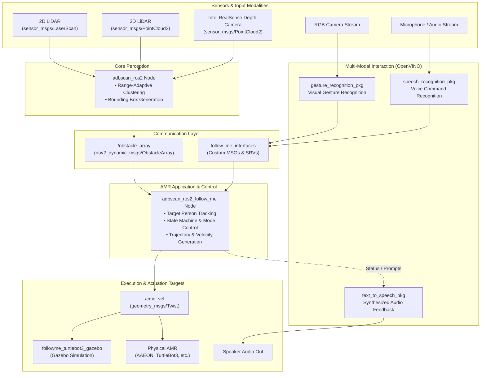

<!--
Copyright (C) 2026 Intel Corporation

SPDX-License-Identifier: Apache-2.0
-->

# ADBSCAN (Adaptive Density-Based Spatial Clustering of Applications with Noise)

## Documentation

Comprehensive documentation on this component is available here: [dev guide](https://developer.robotics.intel.com/development-stack/components/optimized_solutions/adbscan-follow-me/)

## Overview

ADBSCAN (Adaptive Density-Based Spatial Clustering of Applications with Noise) is an Intel-patented unsupervised clustering algorithm that groups spatial point cloud data based on range-adaptive density. Unlike standard DBSCAN—which uses fixed clustering radius ($\epsilon$) and point density thresholds ($MinPts$)—ADBSCAN dynamically scales these parameters relative to sensor distance. This compensates for point cloud beam divergence and sparsity at longer ranges, improving object detection range by 20–30% on average and making it particularly well suited for LiDAR and depth camera processing on Autonomous Mobile Robots (AMRs).

### What This Repository Provides

This repository provides both the standalone ADBSCAN clustering perception pipeline and a complete multi-modal "Follow-Me" AMR reference application with simulation and hardware deployment assets:

1. **Perception & Spatial Clustering (`adbscan_ros2`)**
   - Ingests 2D LiDAR (`sensor_msgs/LaserScan`), 3D LiDAR (`sensor_msgs/PointCloud2`), or Intel® RealSense™ depth data.
   - Computes range-adaptive bounding boxes and clusters in real time.
   - Publishes segmented obstacles using `nav2_dynamic_msgs::msg::ObstacleArray`.

2. **AMR Reference Application (`adbscan_ros2_follow_me`)**
   - Tracks a designated person using ADBSCAN cluster centroids.
   - Publishes differential-drive navigation commands (`geometry_msgs/msg/Twist`).
   - Supports four operating modes combining LiDAR or RealSense depth tracking with optional gesture and voice interaction.

3. **Multi-Modal Interaction Packages (Intel® OpenVINO™)**
   - `gesture_recognition_pkg`: Visual hand-gesture recognition for robot start/stop and direction control.
   - `speech_recognition_pkg`: Offline voice command parsing using OpenVINO.
   - `text_to_speech_pkg`: Audio feedback and status prompts.
   - `follow_me_interfaces`: Custom ROS 2 interfaces, actions, and services connecting the perception and interaction nodes.

4. **Simulation, Hardware Deployment, and Verification**
   - `followme_turtlebot3_gazebo`: Gazebo simulation environments for TurtleBot3.
   - Ready-to-use launch files and configurations for commercial platforms (AAEON AMR, RPLidar, RealSense D435/D455).
   - Automated synthetic headless E2E testing with pytest and ROS 2 launch testing.

### Architecture



### Supported Sensor Modalities & Target Platforms

- **Sensor Types**: 2D LiDAR, 3D LiDAR, Intel® RealSense™ Depth Cameras (D435, D455)
- **Actuation**: Differential drive robots (`cmd_vel`)
- **Operating Systems & ROS 2 Distros**:
  - Ubuntu 22.04 LTS (ROS 2 Humble)
  - Ubuntu 24.04 LTS (ROS 2 Jazzy)

## Getting Started

### System Requirements

Prepare the target system following the [official documentation](https://developer.robotics.intel.com/development-stack/platform_foundation/getting_started/).

### Environment Setup & Prerequisites

1. **Verify Developer Tooling**:
   Ensure required build tools (`ninja`, `colcon`, `docker`, `python3`) and linters are present on the host:

   ```bash
   make tools-check
   ```

2. **Select and Source ROS 2 Distribution**:

   ```bash
   # For Ubuntu 24.04 (Jazzy)
   export ROS_DISTRO=jazzy
   source /opt/ros/jazzy/setup.bash  # or setup.zsh for Zsh

   # For Ubuntu 22.04 (Humble)
   export ROS_DISTRO=humble
   source /opt/ros/humble/setup.bash  # or setup.zsh for Zsh
   ```

3. **Install Package Build Dependencies**:
   Generate Debian control files and install required build dependencies via APT:

   ```bash
   make debian-build-deps
   sudo make install-debian-build-deps
   ```

   *(Requires `devscripts`, `equivs`, and `dpkg-dev`).*

---

### Workflow A: Local Source Development (Colcon)

Use this workflow to build, iterate, and run packages directly from the repository source:

1. **Build Packages**:

   ```bash
   make build
   ```

   This executes `colcon build --symlink-install` across all packages declared in [robotics-project.json](robotics-project.json), creating build artifacts in `build/` and symlinks in `install/`.

2. **Source the Workspace Overlay**:

   ```bash
   source install/setup.bash  # or setup.zsh for Zsh
   ```

3. **Verify Package Availability**:

   ```bash
   ros2 pkg list | grep -E 'adbscan|follow_me|gesture|speech|text_to_speech'
   ```

---

### Workflow B: Debian Package Creation & System Installation

Use this workflow to generate release Debian packages (`.deb`) via CMake and CPack:

1. **Build Debian Packages**:

   ```bash
   make package
   ```

   Native `.deb` packages will be placed into `build/debian-packages/packages/`:

   ```bash
   ls build/debian-packages/packages/*.deb
   ```

   ```text
   ros-jazzy-adbscan-ros2_2.3-1_amd64.deb
   ros-jazzy-adbscan-ros2-follow-me_2.3-1_amd64.deb
   ros-jazzy-follow-me-interfaces_2.3-1_amd64.deb
   ros-jazzy-gesture-recognition-pkg_2.3-1_amd64.deb
   ros-jazzy-speech-recognition-pkg_2.3-1_amd64.deb
   ros-jazzy-text-to-speech-pkg_2.3-1_amd64.deb
   ros-jazzy-followme-turtlebot3-gazebo_2.3-1_amd64.deb
   ```

2. **Install Built Debian Packages**:

   ```bash
   sudo apt update
   sudo apt install -y ./build/debian-packages/packages/*.deb
   ```

---

### Cleaning Build Artifacts

To clean up all local build, install, log, coverage, and package artifacts:

```bash
make clean
```

## Testing and Verification

The repository employs a multi-tiered testing strategy to validate algorithm correctness, node communication, and test coverage before deployment.

### 1. Colcon Unit & Algorithmic Tests

- **What is tested**: Core clustering algorithms, bounding box calculations, and mathematical utility functions via Google Test (`gtest`).
- **Why we test it**: To verify that the ADBSCAN adaptive clustering logic deterministically partitions point clouds into expected clusters and does not regress.
- **How to run**:

  ```bash
  ROS_DISTRO=jazzy make test
  ```

  *(Builds with `-DBUILD_TESTING=ON`, executes all package-level unit tests sequentially, and returns non-zero on test failures).*

### 2. End-to-End (E2E) Headless Launch Tests

- **What is tested**: Full ROS 2 node lifecycle and topic publication using `launch_testing` and `pytest` ([tests/test_adbscan_topic_publication.py](tests/test_adbscan_topic_publication.py)).
- **Why we test it**: Algorithmic tests run in isolation; E2E launch tests verify that the actual node executables (`adbscan_pub`) spin up cleanly in the ROS graph and advertise expected topics (`/Obstacle_Array` with type `nav2_dynamic_msgs/msg/ObstacleArray`).
- **How to run**:

  ```bash
  ROS_DISTRO=jazzy make test-e2e
  ```

  Results are recorded to `testout/adbscan_e2e.xml`.

### 3. C++ Code Coverage Analysis

- **What is tested**: Line and branch coverage across C++ source files under `src/` (excluding third-party code and build artifacts).
- **Why we test it**: To monitor test thoroughness, identify untested branches in clustering heuristics, and track code quality over time.
- **How to run**:

  ```bash
  ROS_DISTRO=jazzy make coverage
  ```

  *(Requires `gcovr` and `uv`).* Generates an interactive HTML report at `testout/coverage/index.html` and an XML report at `testout/coverage/coverage.xml`.

### 4. Test Result Reporting

- **What is tested**: Aggregates and parses XML test artifacts from `build/*/test_results/`.
- **Why we test it**: Produces a standardized markdown summary for developer inspection and CI workflow status checks.
- **How to run**:

  ```bash
  ROS_DISTRO=jazzy make test-results
  ```

  Outputs summary to `testout/test-summary.md`.

## Development and Quality Assurance

The codebase enforces strict code formatting, linting, licensing, and CI standards to maintain repository health and prevent regressions.

### Source Formatting

Before committing changes, apply standard automated formatting across C/C++, Python, and Markdown files:

```bash
make format
```

This runs:

- `clang-format` on C/C++ files using the ROS 2 Jazzy rules defined in [.clang-format](.clang-format).
- `ruff format` and `ruff check --fix` on Python scripts following [.ruff.toml](.ruff.toml).
- `markdownlint --fix` on Markdown documents using [.github/linters/.markdown-lint.yml](.github/linters/.markdown-lint.yml).

### Linters & Static Analysis

Validate code quality and syntax across tracked repository files:

```bash
make lint
```

You can also run individual linters targeting specific languages or files:

| Target | Tool | Scope / Rules |
| --- | --- | --- |
| `make lint-clang-format` | `clang-format` | C/C++ formatting validation against [.clang-format](.clang-format) |
| `make lint-ruff` | `ruff` | Python linting and code style against [.ruff.toml](.ruff.toml) |
| `make lint-bash` | `shellcheck` | Bash script error and syntax checking |
| `make lint-yaml` | `yamllint` | YAML formatting against [.github/linters/.yaml-lint.yml](.github/linters/.yaml-lint.yml) |
| `make lint-json` | `python3 -m json.tool` | JSON syntax validation (e.g., [robotics-project.json](robotics-project.json)) |
| `make lint-markdown` | `markdownlint` | Markdown document rules via [.github/linters/.markdown-lint.yml](.github/linters/.markdown-lint.yml) |
| `make lint-actionlint` | `actionlint` | GitHub Actions workflow syntax via [.github/linters/actionlint.yml](.github/linters/actionlint.yml) |

### License Compliance (REUSE)

All source files require proper copyright and SPDX-License-Identifier headers. Run the containerized REUSE tool to verify compliance:

```bash
make license-check
```

### Pre-push and CI Validation

Before pushing branches or opening a Pull Request:

1. **Local Pre-Push Verification**:

   ```bash
   make check
   ```

   Runs `lint` and `license-check`.

2. **Multi-Distro Packaging & Test Verification**:

   ```bash
   make check-ci
   ```

   Validates package creation (`make package`) and test execution (`make test`) across both Ubuntu 22.04 (Humble) and Ubuntu 24.04 (Jazzy).

3. **Source Packaging**:

   ```bash
   make source-package
   ```

   Generates a clean source archive (`adbscan-<version>.zip`) from HEAD, excluding build artifacts and temporary files.

### Makefile Target Reference

Run `make help` to inspect available development targets:

```bash
make help
```

## Usage and Documentation

### Quickstart: Running Nodes and Demos

Ensure your workspace environment is active (`source install/setup.bash` or `setup.zsh`).

#### 1. Run the ADBSCAN Clustering Node

Launch the core clustering node configured for 2D LiDAR or Intel® RealSense™:

```bash
# For 2D LiDAR input
ros2 launch adbscan_ros2 play_demo_lidar_launch.py

# For Intel RealSense depth camera input
ros2 launch adbscan_ros2 play_demo_realsense_launch.py
```

Verify that segmented obstacle clusters are being published:

```bash
ros2 topic echo /Obstacle_Array
```

#### 2. Run the Follow-Me Gazebo Simulation

Launch the multi-modal TurtleBot3 simulation in Gazebo:

```bash
# LiDAR tracking with gesture and audio control
ros2 launch followme_turtlebot3_gazebo lidar_gesture_audio.launch.py

# RealSense depth camera tracking with gesture control
ros2 launch followme_turtlebot3_gazebo rs_gesture.launch.py
```

---

### Documentation Index

Detailed documentation, launch options, and hardware deployment guides are organized as follows:

#### Package Guides

- [src/adbscan_ros2/Readme.md](src/adbscan_ros2/Readme.md) — Node architecture, sensor configuration YAMLs (2D LiDAR, 3D LiDAR, RealSense), topic schemas, and RViz visualization.
- [docs/followme_turtlebot3_gazebo_readme.md](docs/followme_turtlebot3_gazebo_readme.md) — Gazebo simulation setup, TurtleBot3 models, spawn scripts, and launch scenarios.

#### Follow-Me Application & Interaction

- [docs/follow_me_readme.md](docs/follow_me_readme.md) — Complete follow-me application manual, four operating demo modes, and OpenVINO gesture/speech interaction.
- [docs/follow_me_requirements.md](docs/follow_me_requirements.md) — System requirements, Python virtual environment setup, and OpenVINO model configuration.

#### Sensor & Robot Hardware Deployment

- [docs/adbscan_aaeon_robot.md](docs/adbscan_aaeon_robot.md) — Deploying ADBSCAN on physical AAEON AMR platforms.
- [docs/adbscan-realsense.md](docs/adbscan-realsense.md) — Intel® RealSense™ D435/D455 camera setup, camera drivers, and tuning.
- [docs/adbscan-rplidar.md](docs/adbscan-rplidar.md) — RPLidar hardware integration, serial configuration, and launch parameters.

#### Algorithm & Performance

- [docs/IA-optimized-adbscan-algorithm.md](docs/IA-optimized-adbscan-algorithm.md) — Mathematical formulation of range-adaptive clustering and Intel Architecture CPU vectorization optimizations.
- [Online Developer Guide](https://developer.robotics.intel.com/development-stack/components/optimized_solutions/adbscan-follow-me/) — Official Intel Edge AI Suites component documentation.

## License

`ADBSCAN` is licensed under [Apache 2.0 License](./LICENSES/Apache-2.0.txt).
