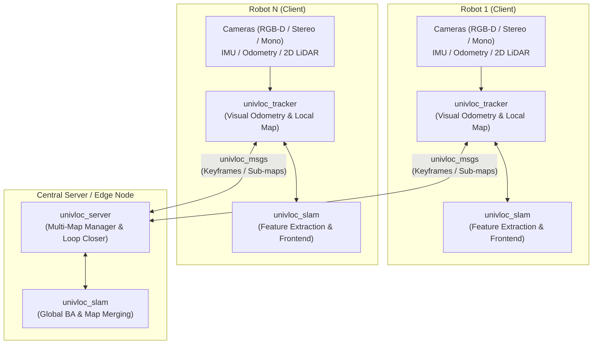

<!--
Copyright (C) 2026 Intel Corporation

SPDX-License-Identifier: Apache-2.0
-->

# Collaborative SLAM (CSLAM)

## Documentation

Comprehensive documentation on this component is available here: [dev guide](https://developer.robotics.intel.com/development-stack/components/optimized_solutions/collaborative-slam/).

## Overview

**Collaborative SLAM (CSLAM)** is an open-source, multi-robot visual SLAM framework designed for autonomous mobile robots (AMRs) operating individually or in shared fleets. Built on ROS 2, CSLAM enables multiple robots to collaboratively construct, optimize, and share unified 3D keyframe/landmark maps and 2D occupancy grids in real time.



### Key Capabilities

- **Heterogeneous Sensor Fusion:** Supports primary visual input from monocular, stereo, or RGB-D cameras, fused with auxiliary wheel odometry, IMU (inertial), and 2D LiDAR.
- **Client-Server Architecture:** Lightweight tracker nodes run directly on individual robots for real-time local tracking and mapping, while a centralized server node coordinates global loop closure, multi-map merging, and map distribution across the fleet.
- **Versatile Operating Modes:** Supports four operational modes:
  - **Mapping:** Simultaneous exploration and environment mapping.
  - **Localization:** Real-time pose estimation within pre-built maps.
  - **Remapping:** Targeted online map updating and correction of specified regions.
  - **Relocalization:** Diagnostic and recovery pose re-acquisition.
- **Fast Mapping Support:** Generates real-time 2D occupancy grids (for Nav2 path planning) and 3D volumetric octree maps alongside visual feature maps.
- **Intel Hardware Acceleration:** Leverages Intel® Arc™ graphics with Intel Level Zero (`liborb-lze`) for hardware-accelerated ORB feature extraction.

### Core Architecture

The system is organized into four core ROS packages located in `src/`:

- **`univloc_tracker` (Tracker Node):** Runs on the robot to perform real-time front-end visual tracking, sensor fusion (IMU, wheel odometry, LiDAR), and local map management. It can operate as an autonomous standalone node or communicate with the server to query and update global maps.
- **`univloc_server` (Server Node):** Manages global multi-robot maps. It receives keyframes from active trackers, detects intra-map and inter-map loop closures, executes global bundle adjustment and map merging, and distributes updated map fragments back to robots.
- **`univloc_slam` (SLAM Engine):** Contains the core SLAM algorithms, feature management, pose graph optimization, and spatial representations.
- **`univloc_msgs` (Communication Interfaces):** Defines ROS 2 message and service interfaces used for efficient tracker-to-server data transmission and map synchronization.

In addition to core components, tutorial packages are provided under `src/` to demonstrate 2D LiDAR integration, fast mapping, multi-camera setups, region remapping, and multi-robot collaboration.

Refer to [this paper](https://arxiv.org/abs/2102.03228) for more explanation of the system.

## Get Started

### System Requirements

Prepare the target system following the [official documentation](https://developer.robotics.intel.com/development-stack/platform_foundation/getting_started/).

We support Ubuntu 22.04 with [ROS 2 Humble](https://docs.ros.org/en/humble/Installation/Ubuntu-Install-Debians.html) and Ubuntu 24.04 with [ROS 2 Jazzy](https://docs.ros.org/en/jazzy/Installation/Ubuntu-Install-Debs.html).

#### Hardware Requirements

- **CPU:** Intel® Core™ Ultra (Series 3) processor
- **GPU:** Intel® Arc™ graphics
- **RAM:** 16GB minimum

### Build Tools & Dependencies

Building and packaging Collaborative SLAM requires the following host tools and dependencies:

#### Core Build & Packaging Tools

- `build-essential` (C/C++ compiler toolchain)
- `cmake` (version 3.16 or higher)
- `ninja-build` (Ninja build system)
- `colcon` (`python3-colcon-common-extensions`)
- `devscripts` (provides `mk-build-deps`)
- `equivs` (provides `equivs-build`)
- `dpkg-dev` (provides `dpkg-checkbuilddeps`)

Install the required host packaging tools via APT:

```bash
sudo apt update && sudo apt install -y \
  build-essential \
  cmake \
  ninja-build \
  python3-colcon-common-extensions \
  devscripts \
  equivs \
  dpkg-dev
```

#### GPU & Acceleration Dependencies

For GPU-accelerated feature extraction:

- Intel Level Zero runtime and development headers (`libze1`, `libze-dev`)
- Level Zero ORB extractor library (`liborb-lze-dev`), available exclusively through the Intel Robotics AI Suite (AMR) APT repository

#### Developer & Code Quality Tools (Optional)

Used by `make lint`, `make format`, and validation targets:

- `clang-format`
- `ruff`
- `shellcheck`
- `yamllint`
- `actionlint`
- `markdownlint-cli2`
- `docker` (required for `make license-check`)

Verify installed developer tools with:

```bash
make tools-check
```

### Build & Package Workflow

The repository provides a Makefile-driven workflow for building native Debian packages as well as local Colcon development builds.

#### 1. Install Debian Build Dependencies

Before building packages or developing locally, generate and install declared Debian build dependencies using APT:

```bash
# Source ROS environment
source /opt/ros/jazzy/setup.bash   # Or /opt/ros/humble/setup.bash

# Install dependencies via equivs and APT
make ROS_DISTRO=jazzy install-debian-build-deps
```

#### 2. Build Debian Packages

Build native Debian packages with CMake and Ninja:

```bash
make ROS_DISTRO=jazzy package
```

Built Debian packages are output to `build/debian-packages/packages/`:

```bash
ls build/debian-packages/packages/*.deb
```

Generated packages include:

- `ros-<distro>-collab-slam`: Metapackage pulling in server, tracker, slam, and msgs
- `ros-<distro>-univloc-msgs`: Interface and message definitions
- `ros-<distro>-univloc-slam`: Core SLAM library
- `ros-<distro>-univloc-tracker`: Tracker node
- `ros-<distro>-univloc-server`: Server node
- `ros-<distro>-cslam-tutorial-*`: Tutorial packages (common, 2d-lidar, fastmapping, multi-camera, region-remap, two-robot, all)

To clean build artifacts:

```bash
make clean
```

### Local Development Workflow

For interactive development, build and test directly with Colcon:

```bash
source /opt/ros/jazzy/setup.bash   # Or /opt/ros/humble/setup.bash

# Build ROS packages with Colcon
make ROS_DISTRO=jazzy build

# Run unit and integration tests
make ROS_DISTRO=jazzy test

# Run headless pytest E2E smoke tests
make ROS_DISTRO=jazzy test-e2e
```

Bag-backed integration tests are registered only when their fixtures are present
under `/opt/ros/<distro>/share/bagfiles`. To use another location, point
`BAGFILE_DIR` at the root containing `robot1`, `robot2`, `cslam-unit-test`,
and `2d-lidar` before running `make test`:

```bash
BAGFILE_DIR=/path/to/bagfiles make ROS_DISTRO=jazzy test
```

The `test-e2e` smoke test needs the `demo-mapping` bag. Without it, pytest
reports the test as skipped. For this target, `BAGFILE_DIR` points to the bag
directory itself:

```bash
BAGFILE_DIR=/path/to/bagfiles/cslam-unit-test/demo-mapping make ROS_DISTRO=jazzy test-e2e
```

### Install Debian Packages

Install the Debian packages generated from `make package`:

```bash
sudo apt update
sudo apt install ./build/debian-packages/packages/*.deb
```

### Code Quality & Validation

Prepared Makefile targets simplify pre-commit checks and linting:

```bash
# Verify required developer tools are installed
make tools-check

# Run all local linters (actionlint, ruff, shellcheck, yamllint, markdownlint, clang-format)
make lint

# Apply source formatting automatically
make format

# Run license compliance check
make license-check

# Run full pre-push check (lint + license-check)
make check
```

To see all available Makefile targets:

```bash
make help
```

```text
Target                    Description
------                    -----------
build                     Build selected ROS packages with Colcon for local development
check                     Run locally reproducible pre-push checks
check-ci                  Run package and Colcon validation for Humble and Jazzy
clean                     Remove local build, install, log, test, and package artifacts
coverage                  Generate non-gating C++ line and branch coverage reports
debian-build-deps         Generate Debian Build-Depends control files without configuring components
format                    Apply local source formatting
install-debian-build-deps Install generated Debian Build-Depends with APT
license-check             Perform a REUSE license check using docker container https://hub.docker.com/r/fsfe/reuse
lint                      Run all local linters on tracked files
lint-bash                 Run Bash linting
lint-json                 Run JSON linting
lint-markdown             Run Markdown linting
lint-yaml                 Run YAML linting
package                   Build Debian packages
source-package            Create source package tarball
test                      Build & test with Colcon
test-e2e                  Run headless pytest E2E smoke tests from the active ROS prefix
test-results              Summarize Colcon test results
tools-check               Verify locally installed developer tools
```

## Usage

### Environment Setup

Before executing any commands, source your ROS 2 environment:

```bash
# If using installed Debian packages:
source /opt/ros/$ROS_DISTRO/setup.bash

# Or if using a local Colcon workspace:
source install/setup.bash
```

> **Tip for zsh users:** In zsh terminals, source `setup.zsh` rather than `setup.bash` to avoid path resolution discrepancies.

### Operating Modes & Launch Concepts

The tracker and server are ROS 2 nodes configured via ROS parameters. Launch files and parameters are located under:

- Tracker launch: [src/univloc_tracker/launch/tracker.launch.py](src/univloc_tracker/launch/tracker.launch.py)
- Server launch: [src/univloc_server/launch/server.launch.py](src/univloc_server/launch/server.launch.py)
- Tracker parameter configuration: [src/univloc_tracker/config/tracker.yaml](src/univloc_tracker/config/tracker.yaml)

Collaborative SLAM supports four operating modes configured via `slam_mode` (tracker) and `server_mode` (server):

1. **Mapping Mode (`slam_mode:=mapping`, `server_mode:=mapping`):** Default mode. Explores and constructs a shared keyframe/landmark map.
2. **Localization Mode (`slam_mode:=localization`, `server_mode:=localization`):** Operates on a pre-built map, performing real-time pose estimation without adding new landmarks.
3. **Remapping Mode (`slam_mode:=remapping`, `server_mode:=remapping`):** Selectively updates and corrects pre-built keyframe/landmark and octree maps within a user-specified 2D region.
4. **Relocalization Mode (`slam_mode:=relocalization`, `server_mode:=relocalization`):** Pose re-acquisition against a loaded map for debugging, testing, or recovery.

> **Note:** A mismatch between tracker and server operating modes may lead to unpredictable results.

Pre-configured launch files are also provided for various sensors and benchmarks:

- **Intel® RealSense™ D400-Series RGB-D / OpenLORIS-Scene:** `tracker.launch.py`
- **TUM RGB-D:** `tum_rgbd.launch.py`
- **EuRoC MAV (Stereo/Mono + IMU):** `euroc_mono.launch.py`, `euroc_stereo.launch.py`
- **KITTI Odometry:** `kitti_mono.launch.py`, `kitti_stereo.launch.py`

### Basic Launch Commands

**To support multi-robot collaboration, multi-camera setups, loop closure, or persistent map saving, launch `univloc_server` first. For single-robot visual odometry and local mapping, launching `univloc_tracker` standalone is sufficient.**

#### Launching the Server

```bash
# For stereo, RGB-D, or visual-inertial setups
ros2 launch univloc_server server.launch.py

# For monocular cameras (scale unknown / unconstrained)
ros2 launch univloc_server server.launch.py fix_scale:=false
```

#### Launching the Tracker

On each robot, launch the tracker node with a unique ID:

```bash
# Replace <unique_id> and camera parameters to match your robot configuration
ros2 launch univloc_tracker tracker.launch.py camera:=<camera_name> publish_tf:=false queue_size:=0 ID:=<unique_id> rviz:=false gui:=false camera_fps:=30.0
```

### Multi-Robot Networking & Namespaces

When deploying on a multi-robot fleet:

- **Shared Domain ID:** If running across multiple machines, assign matching `ROS_DOMAIN_ID` values (between 0 and 101) on all robots and the server. Sourced environments visualize published map keyframes and landmarks on `/univloc_server/{keypoints,keyframes}` in RViz.
- **Namespacing:** Run each tracker under its robot namespace to isolate sensor topics:

  ```bash
  ros2 launch univloc_tracker tracker.launch.py camera:=d400 publish_tf:=false queue_size:=0 ID:=0 namespace:=robot1 camera_fps:=30.0
  ```

- **Resetting on Lost Frames:** Configure tracking resilience in dynamic or large-scale environments:

  ```bash
  # Enable automatic resetting if lost consecutively for 10 frames
  ros2 launch univloc_tracker tracker.launch.py camera_fps:=30.0 num_lost_frames_to_reset:=10
  ```

### Intel® Arc™ GPU Acceleration (Level Zero)

Visual feature extraction (ORB extraction) can be offloaded to Intel® Arc™ graphics via Intel Level Zero (`liborb-lze`) to free CPU cores:

1. **Verify GPU Render Node Access:**
   Ensure your Intel® Arc™ GPU is detected and that your user account has access to the `/dev/dri` render nodes:

   ```bash
   # Check Intel GPU detection
   lspci -v | grep -A10 VGA

   # Grant user permission to render device nodes
   sudo usermod -a -G render,video $USER
   ```

   *(Note: If running inside Docker, add `--device /dev/dri --group-add render` to the `docker run` command).*

2. **Install Level Zero Dependencies:**
   Ensure the Intel Level Zero runtime and Level Zero ORB extractor library (from the AMR repository) are installed:

   ```bash
   sudo apt update && sudo apt install -y \
     intel-level-zero-gpu \
     libze1 \
     libze-dev \
     liborb-lze-dev
   ```

3. **Running with GPU Acceleration:**
   - **Debian Packages:** Install and run the `-lze` package variant (`ros-<distro>-univloc-tracker-lze` / `ros-<distro>-collab-slam-lze`).
   - **Local Colcon Build:** Enable GPU feature extraction by passing `-DUSE_GPU_LEVEL_ZERO=ON` during build:

     ```bash
     colcon build --base-paths src --packages-select univloc_slam univloc_tracker \
       --cmake-args -DUSE_GPU_LEVEL_ZERO=ON
     ```

   *(Note: `-DUSE_GPU_CM=1` is supported as a backward-compatible alias).*

   When initialized, the tracker logs the Level Zero GPU kernel path and offloads ORB extraction to the GPU.

### Operating Mode Workflows

#### 1. Mapping and Map Saving

Map an environment and persist the map file:

```bash
# Terminal A: Server (saves map and trajectory on shutdown)
ros2 launch univloc_server server.launch.py fix_scale:=true save_map_path:=/path/to/saved/map.msg save_traj_folder:=/path/to/saved/trajectories/

# Terminal B: Tracker
ros2 launch univloc_tracker tracker.launch.py publish_tf:=true queue_size:=0 slam_mode:=mapping camera_fps:=30.0
```

#### 2. Localization Mode

Once a map has been saved, load the map to run pure localization:

```bash
# Terminal A: Server (loads saved map)
ros2 launch univloc_server server.launch.py server_mode:=localization fix_scale:=true load_map_path:=/path/to/saved/map.msg

# Terminal B: Tracker (localizes against the loaded map)
ros2 launch univloc_tracker tracker.launch.py publish_tf:=true queue_size:=0 slam_mode:=localization map_frame:=map-0 camera_fps:=30.0
```

#### 3. Remapping Mode

To update an existing map in dynamic environments:

1. Load the pre-constructed map in `remapping` mode.
2. Specify the target 2D update boundary using user-defined region vertices or the RViz **Publish Point** tool.
3. For full workflow instructions, refer to [remapping_mode.md](docs/remapping_mode.md).

#### 4. Relocalization Mode (Debug / Recovery)

Verify pose re-acquisition at specific map locations without publishing tf:

```bash
# Terminal A: Server
ros2 launch univloc_server server.launch.py server_mode:=relocalization fix_scale:=true load_map_path:=/path/to/saved/map.msg

# Terminal B: Tracker (publish_tf must be set to false in relocalization mode)
ros2 launch univloc_tracker tracker.launch.py publish_tf:=false queue_size:=0 rviz:=false gui:=true slam_mode:=relocalization traj_store_path:=/path/to/saved/ map_frame:=map-0 camera_fps:=30.0
```

#### 5. Fast Mapping (2D Occupancy Grid & 3D Volumetric Map)

Collaborative SLAM can generate a real-time 2D Occupancy Grid (topic `/map` for Nav2 path planning) and a 3D Volumetric Octree (topic `/fused_map`):

```bash
# Enable Fast Mapping via tracker launch parameter
ros2 launch univloc_tracker tracker.launch.py enable_fast_mapping:=true camera_fps:=30.0
```

Detailed parameter configuration (e.g. resolution, minimum/maximum z-heights) is managed in [tracker.yaml](src/univloc_tracker/config/tracker.yaml). See [use_fast_mapping.md](docs/use_fast_mapping.md) for complete details.

### Packaged Tutorials (`cslam_tutorial_*`)

Ready-to-run demo scripts are packaged under `src/` to demonstrate key AMR capabilities with recorded bag data:

- **Fast Mapping Tutorial:** `src/cslam_tutorial_fastmapping/scripts/cslam-fastmapping.sh`
- **2D LiDAR Fusion Tutorial:** `src/cslam_tutorial_2d_lidar/scripts/cslam-2d-lidar.sh`
- **Two-Robot Collaboration:** `src/cslam_tutorial_two_robot/scripts/cslam-two-robot.sh`
- **Multi-Camera Fusion:** `src/cslam_tutorial_multi_camera/scripts/cslam-multi-camera.sh`
- **Region Remapping:** `src/cslam_tutorial_region_remap/scripts/cslam-region-remap.sh`

### Live Sensor Example: Intel® RealSense™ D400-Series Camera

```bash
# Terminal A: Start the server
ros2 launch univloc_server server.launch.py fix_scale:=true

# Terminal B: Start the tracker (RGB-D)
ros2 launch univloc_tracker tracker.launch.py camera:=camera get_camera_extrin_from_tf:=false pub_tf_child_frame:=camera_link camera_fps:=30.0

# Terminal C: Start the RealSense camera node
ros2 launch realsense2_camera rs_launch.py align_depth:=true align_depth.enable:=true init_reset:=true
```

### Public Benchmark Datasets

Pre-configured launch files are included for validating with standard visual SLAM datasets:

#### OpenLORIS-Scene Dataset

Supports the [OpenLORIS-Scene Dataset](https://lifelong-robotic-vision.github.io/dataset/scene.html):

```bash
# Terminal A: Server
ros2 launch univloc_server server.launch.py fix_scale:=true

# Terminal B: Tracker (RGB-D)
ros2 launch univloc_tracker tracker.launch.py camera:=d400 publish_tf:=false queue_size:=0 camera_fps:=30.0

# Terminal C: Replay dataset bag
ros2 bag play OPENLORIS/market1-1/
```

#### TUM RGB-D Dataset

Supports the [TUM RGB-D Dataset](https://cvg.cit.tum.de/data/datasets/rgbd-dataset/download):

```bash
# Terminal A: Server
ros2 launch univloc_server server.launch.py fix_scale:=true

# Terminal B: Tracker (select sequence group: fr1, fr2, or fr3)
ros2 launch univloc_tracker tum_rgbd.launch.py gui:=false rviz:=false publish_tf:=false log_level:=warning fr1:=true

# Terminal C: Replay dataset bag
ros2 bag play TUM/rgbd_dataset_freiburg1_floor/
```

#### EuRoC MAV Dataset

Supports the [EuRoC MAV Dataset](https://projects.asl.ethz.ch/datasets/doku.php?id=kmavvisualinertialdatasets):

```bash
# Terminal A: Server
ros2 launch univloc_server server.launch.py fix_scale:=true correct_loop:=true

# Terminal B: Tracker (Stereo + IMU)
ros2 launch univloc_tracker euroc_stereo.launch.py camera_setup:=Stereo_Inertial gui:=false rviz:=false publish_tf:=false log_level:=warning clean_keyframe:=true

# Terminal C: Replay dataset bag
ros2 bag play EuRoC/V2_01_easy/
```

#### KITTI Odometry Dataset

Supports the [KITTI Odometry Grayscale Dataset](https://www.cvlibs.net/datasets/kitti/eval_odometry.php):

```bash
# Terminal A: Server
ros2 launch univloc_server server.launch.py fix_scale:=true

# Terminal B: Tracker (Stereo, sequence s00_02, s03, or s04_12)
ros2 launch univloc_tracker kitti_stereo.launch.py camera_setup:=Stereo gui:=false rviz:=false publish_tf:=false log_level:=warning s00_02:=true

# Terminal C: Replay dataset bag
ros2 bag play KITTI/kitti_data_odometry_gray_sequence_00/
```

## Troubleshooting

### GPU Initialization or Access Denied (`/dev/dri`)

If Level Zero acceleration fails to initialize or feature extraction falls back to CPU:

- **Check Render Node Permissions:** Ensure your user account belongs to the `render` and `video` groups:

  ```bash
  sudo usermod -a -G render,video $USER
  ```

  After adding groups, log out and log back in for changes to take effect.
- **Docker Access:** When running within a container, ensure `/dev/dri` devices and the render group are forwarded:

  ```bash
  docker run --device /dev/dri --group-add render ...
  ```

### Missing Level Zero ORB Extractor Dependency

If CMake reports that `orblze` cannot be found:

- `liborb-lze-dev` is distributed through the Intel Robotics AI Suite (AMR) APT repository. Verify the repository is added to your APT sources before installing build dependencies:

  ```bash
  sudo apt update && sudo apt install -y liborb-lze-dev
  ```

### Multi-Robot Network Discovery & Synchronization

If the tracker node cannot discover or synchronize keyframes with `univloc_server` across separate machines:

- **ROS Domain ID:** Ensure that `ROS_DOMAIN_ID` is set to the same integer (0–101) on both the robot and server hosts.
- **Multicast / Firewall:** ROS 2 DDS discovery relies on UDP multicast. Verify that the local network or host firewalls allow UDP multicast traffic across machines.

## Additional Documentation

Detailed subsystem and sensor fusion guides are located in the [docs](docs) folder:

- **Coordinate Frames & TF Tree:** [docs/coordinate_definition.md](docs/coordinate_definition.md) defines expected TF tree relationships, frames, and extrinsic transforms.
- **Tracker & Server Communication:** [docs/tracker_server_communication.md](docs/tracker_server_communication.md) details the dual ROS 2 service communication architecture.
- **Odometry Fusion:** [docs/use_odometry.md](docs/use_odometry.md) describes visual-odometry fallback and odometry integration.
- **IMU (Inertial) Fusion:** [docs/use_imu.md](docs/use_imu.md) details visual-inertial tracking and noise parameters.
- **2D LiDAR Fusion:** [docs/use_2d_lidar.md](docs/use_2d_lidar.md) outlines auxiliary 2D LiDAR motion-only bundle adjustment.
- **Fast Mapping:** [docs/use_fast_mapping.md](docs/use_fast_mapping.md) covers 2D occupancy grid and 3D volumetric map generation.
- **Remapping Mode:** [docs/remapping_mode.md](docs/remapping_mode.md) details the 2D quadrilateral region-based map update workflow.

## License

`collaborative-slam` is licensed under [Apache 2.0 License](./LICENSES/Apache-2.0.txt).
