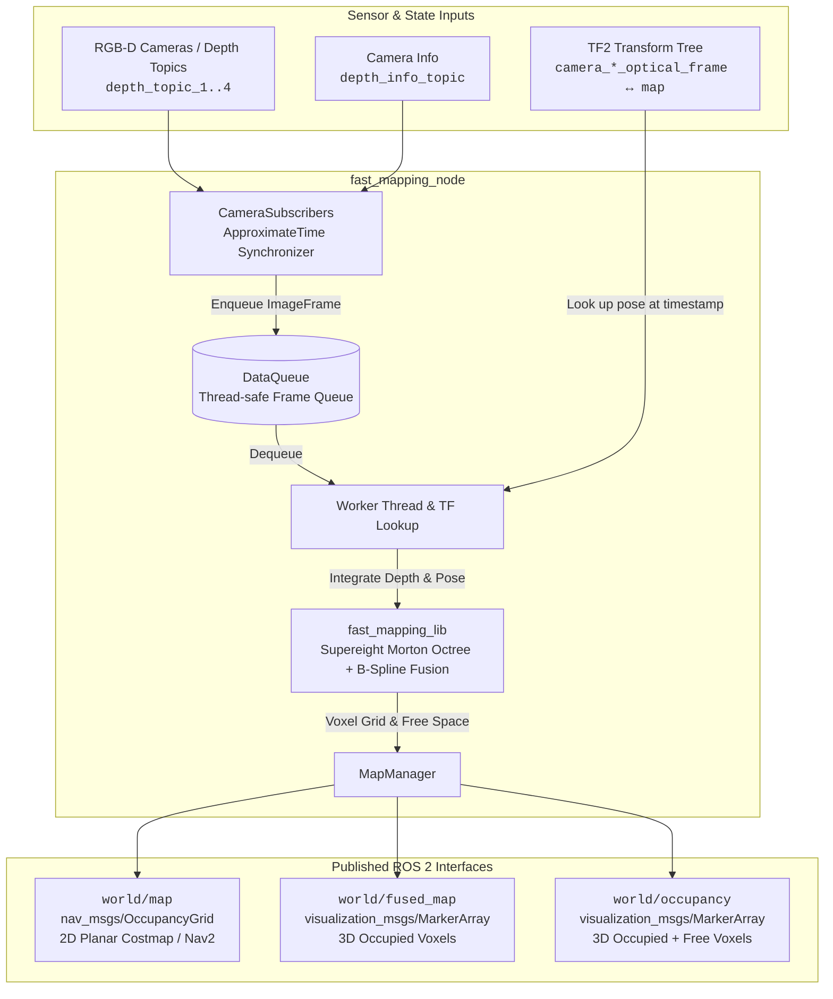

<!--
Copyright (C) 2026 Intel Corporation

SPDX-License-Identifier: Apache-2.0
-->

# FastMapping

FastMapping is an optimized ROS 2 package for real-time 3D volumetric occupancy mapping from RGB-D camera streams, providing lower latency and reduced memory footprint compared to standard OctoMap implementations.

For extended documentation, architecture details, and tutorials, refer to the [Robotics AI Suite FastMapping Guide](https://developer.robotics.intel.com/development-stack/components/optimized_solutions/run-fastmapping-algorithm/).

---

## Overview and Architecture

### Key Features

- **High-Performance 3D Octree**: Built upon an optimized volumetric mapping engine (`fast_mapping_lib`) leveraging Morton code spatial indexing and B-spline depth fusion for fast voxel allocation and updates.
- **2D Planar Map Projection**: Automatically slices and projects 3D obstacles between configurable height bounds (`projection_min_z` to `projection_max_z`) directly into standard `nav_msgs/msg/OccupancyGrid` messages for Nav2 costmaps.
- **Multi-Camera Synchronization**: Synchronizes up to four depth cameras simultaneously using approximate-time message filtering.
- **Dynamic Free-Space Clearing**: Depth measurements update and clear observed free space dynamically, accounting for configured robot footprint clearance (`robot_radius`).
- **Flexible SLAM & Odometry Integration**: Resolves camera poses asynchronously through the ROS 2 TF tree with user-configurable transformation delay tolerance.

### Architectural Comparison: FastMapping vs. Standard OctoMap

Standard OctoMap (`octomap_mapping` / `octovis`) has long been the default 3D volumetric mapping representation in robotics, but encounters computational and memory bottlenecks when handling high-frame-rate depth camera streams on compute-constrained platforms. FastMapping replaces the standard OctoMap backend with the **Supereight** volumetric engine and introduces algorithmic optimizations across memory layout, ray integration, and occupancy probability modeling:

| Metric / Dimension | Standard OctoMap (`octomap` / `octomap_server`) | FastMapping (`fast_mapping`) | Architectural Advantage |
| :--- | :--- | :--- | :--- |
| **Octree Indexing** | Pointer-chasing tree traversal: each node allocates 8 pointer references to child nodes. | **Morton Code (Z-order Curve)** spatial hashing. Keyed spatial addresses map 3D voxel coordinates directly to tree levels with bitwise operations. | Eliminates pointer dereferencing overhead; achieves $O(1)$ block lookups and superior CPU cache locality. |
| **Memory Allocation** | Fine-grained, dynamic heap allocations (`new`/`delete`) per individual octree node or leaf. | **Pre-allocated Chunked Memory Pools** (`MemoryPool<VoxelBlock>`, `MemoryPool<Node>`). Allocates contiguous 8x8x8 voxel blocks. | Drastically mitigates heap fragmentation and allocation latency during dynamic map expansion. |
| **Depth Ray Integration** | **Bresenham 3D Ray-Casting**: casts discrete rays per depth pixel from the camera origin through every intermediate voxel cell. | **Projective Forward Mapping**: projects active voxel blocks into the camera image plane via camera intrinsics ($K$), checking only blocks within the camera frustum. | Reduces ray computation complexity from $O(N_{rays} \cdot N_{steps})$ to operations proportional to visible voxel blocks. |
| **Probability & Sensor Model** | Standard log-odds model with static step updates ($\ell_{hit}$, $\ell_{miss}$) along ray paths. | **Continuous B-Spline Depth Fusion (`bfusion`)**: incorporates continuous depth uncertainty models with pre-computed lookup tables (`bspline_lookup`). | Provides smooth probability boundaries around obstacle surfaces and resilience against camera sensor noise. |
| **Downsampling & Scale** | Processes raw depth clouds or requires explicit external voxel grid filtering nodes. | **Integrated Depth Downsampling** (`compute_size_ratio`) directly in the image pipeline before projection. | Configurable tradeoff between spatial detail and compute budget without extra ROS node overhead. |
| **2D Planar Map Generation** | Requires separate nodes (such as `octomap_server`) iterating through tree leaves to project 2D grids. | **Direct Map Projection (`MapManager`)**: projects occupied voxels between configurable z-bounds (`projection_min_z` to `projection_max_z`) directly into standard `nav_msgs/msg/OccupancyGrid`. | Native 2D costmap publishing for Nav2 without auxiliary conversion nodes. |

### Architecture and Data Flow

FastMapping ingests single or multi-camera synchronized depth images and camera intrinsics, looks up camera poses relative to the global map frame via the TF2 buffer, and integrates depth observations into an internal Morton-indexed octree structure using B-spline depth fusion. The integrated volumetric representation is simultaneously published as 3D visual markers for RViz2 and projected into a 2D occupancy grid for navigation stacks such as Nav2.



---

## ROS 2 Interfaces

### Subscribed Topics

| Topic | Type | Description |
| :--- | :--- | :--- |
| `depth_info_topic` | `sensor_msgs/msg/CameraInfo` | Camera intrinsics (default: `camera/aligned_depth_to_color/camera_info`). |
| `depth_topic_1` | `sensor_msgs/msg/Image` | Primary depth image stream (default: `camera/aligned_depth_to_color/image_raw`). |
| `depth_topic_2` | `sensor_msgs/msg/Image` | Second depth stream (active when `depth_cameras >= 2`). |
| `depth_topic_3` | `sensor_msgs/msg/Image` | Third depth stream (active when `depth_cameras >= 3`). |
| `depth_topic_4` | `sensor_msgs/msg/Image` | Fourth depth stream (active when `depth_cameras >= 4`). |

### Published Topics

| Topic | Type | Description |
| :--- | :--- | :--- |
| `world/map` | `nav_msgs/msg/OccupancyGrid` | 2D occupancy grid projected from 3D voxels within configured z-bounds, suitable for Nav2. |
| `world/fused_map` | `visualization_msgs/msg/MarkerArray` | Visual markers of occupied 3D voxels for RViz2. |
| `world/occupancy` | `visualization_msgs/msg/MarkerArray` | Visual markers for both occupied and observed free voxels for RViz2. |

### Transform (TF) Requirements

`fast_mapping_node` requires active coordinate frame transforms in the TF tree between the target global map frame (`map_frame`, default: `map`) and the optical frames indicated in the `header.frame_id` of each incoming depth image (e.g., `camera_color_optical_frame`).

---

## Configuration Parameters

All parameters can be configured via ROS 2 parameter files or passed directly via `--ros-args -p <param>:=<value>`.

| Parameter | Type | Default | Description |
| :--- | :--- | :--- | :--- |
| `map_frame` | `string` | `"map"` | Global map coordinate frame ID. |
| `voxel_size` | `float` | `0.04` | 3D voxel resolution / leaf size in meters. |
| `max_depth_range` | `float` | `3.0` | Maximum depth ray distance in meters to integrate into the map. |
| `projection_min_z` | `float` | `0.1` | Minimum z-coordinate (meters) relative to map frame included in 2D grid projection. |
| `projection_max_z` | `float` | `1.0` | Maximum z-coordinate (meters) relative to map frame included in 2D grid projection. |
| `robot_radius` | `float` | `0.2` | Clearance radius (meters) around robot center cleared as free space. |
| `noise_factor` | `float` | `0.02` | Noise threshold applied when extracting free/occupied cells for the 2D grid. |
| `tf_delay` | `float` | `0.7` | Delay buffer (seconds) permitted for TF lookup synchronization. |
| `zmin` | `float` | `-inf` | Lower z-bound (meters) for volumetric voxel integration. |
| `zmax` | `float` | `inf` | Upper z-bound (meters) for volumetric voxel integration. |
| `depth_cameras` | `int` | `1` | Number of camera inputs to subscribe and synchronize (1 to 4). |
| `depth_info_topic` | `string` | `camera/aligned_depth_to_color/camera_info` | Topic providing camera intrinsics. |
| `depth_topic_1` | `string` | `camera/aligned_depth_to_color/image_raw` | Topic for depth camera 1. |
| `depth_topic_2` | `string` | `camera_left/aligned_depth_to_color/image_raw` | Topic for depth camera 2. |
| `depth_topic_3` | `string` | `camera_right/aligned_depth_to_color/image_raw` | Topic for depth camera 3. |
| `depth_topic_4` | `string` | `camera_rear/aligned_depth_to_color/image_raw` | Topic for depth camera 4. |

---

## Usage

Source the ROS 2 environment before running any nodes:

```bash
source /opt/ros/${ROS_DISTRO}/setup.bash
```

### Run with Sample ROS 2 Bag Data

The sample launch file plays pre-recorded sensor data from `/opt/ros/${ROS_DISTRO}/share/bagfiles/spinning` (provided by `ros-${ROS_DISTRO}-bagfile-spinning`) and opens RViz2:

```bash
ros2 launch fast_mapping fast_mapping.launch.py
```

### Run with Intel® RealSense™ Cameras and RTAB-Map

FastMapping supports single and multi-camera configurations with Intel® RealSense™ RGB-D cameras. Multi-camera setups require homogeneous camera models sharing identical intrinsic parameters, with each camera providing a valid `camera_frame <-> map` transformation in the TF tree.

1. Install RTAB-Map ROS dependencies:

   ```bash
   sudo apt install ros-${ROS_DISTRO}-rtabmap-ros
   ```

2. Launch single-camera mapping with RTAB-Map:

   ```bash
   ros2 launch fast_mapping fast_mapping_rtabmap.launch.py
   ```

3. Launch multi-camera mapping (example using two cameras named `camera_front` and `camera_left`):

   ```bash
   ros2 run fast_mapping fast_mapping_node --ros-args \
       -p depth_cameras:=2 \
       -p depth_topic_1:=camera_front/aligned_depth_to_color/image_raw \
       -p depth_topic_2:=camera_left/aligned_depth_to_color/image_raw \
       -p depth_info_topic:=camera_front/aligned_depth_to_color/camera_info
   ```

### Run with Custom TF Tree and External Odometry / SLAM

When an external SLAM or odometry module publishes coordinate frames to the TF tree, `fast_mapping_node` queries transformations between the map frame (specified by `map_frame`, default: `map`) and the optical frame specified in the header of the depth image messages (for example, `camera_color_optical_frame`).

1. Launch `fast_mapping_node`:

   ```bash
   ros2 run fast_mapping fast_mapping_node
   ```

2. Play recorded ROS 2 bag data in a separate terminal:

   ```bash
   ros2 bag play <path_to_ros2_bag>
   ```

3. Launch RViz2 for visualization:

   ```bash
   rviz2
   ```

---

## Repository Structure

```text
fastmapping/
├── CMakeLists.txt              # Root build configuration for Debian packaging
├── Makefile                    # Developer targets (build, test, lint, package)
├── robotics-project.json       # Project component definition for CI/CD
├── cmake/                      # Packaging and build dependency generation modules
│   ├── GenerateDebianBuildDepends.cmake
│   ├── PackageAll.cmake
│   └── RosDebianPackage.cmake
├── dependencies/               # Upstream license texts and notices
├── docs/                       # Component documentation synced to dev guide
└── src/
    └── fast_mapping/           # ROS 2 package root
        ├── CMakeLists.txt      # ROS 2 ament_cmake build definition
        ├── package.xml         # ROS 2 package metadata and dependencies
        ├── include/            # Node, worker, and subscriber header definitions
        ├── launch/             # ROS 2 launch files and RViz visualization configurations
        ├── src/                # Node implementation and core mapping library
        │   ├── FastMappingNode.cpp
        │   ├── MapManager.cpp
        │   ├── Subscribers.cpp
        │   ├── main.cpp
        │   └── fast_mapping_lib/  # Core volumetric mapping engine (Supereight / OctoMap)
        ├── tests/              # Unit, negative, and integration test suites
        ├── humble/debian/      # Debian changelog for ROS 2 Humble
        └── jazzy/debian/       # Debian changelog for ROS 2 Jazzy
```

---

## System Requirements

- **Supported Operating Systems and ROS Distributions:**
  - Ubuntu 22.04 LTS with ROS 2 Humble
  - Ubuntu 24.04 LTS with ROS 2 Jazzy
- **System Preparation:**
  - Target system setup and prerequisites are documented in the [Platform Foundation Getting Started Guide](https://developer.robotics.intel.com/development-stack/platform_foundation/getting_started/).

### Host Build Dependencies

For local builds and Debian package generation, install the required host utilities:

```bash
sudo apt update && sudo apt install -y \
    build-essential \
    cmake \
    ninja-build \
    devscripts \
    equivs \
    dpkg-dev \
    python3-colcon-common-extensions
```

---

## Building and Packaging

### Build Debian Packages Locally

1. Install Debian build dependencies:

   ```bash
   ROS_DISTRO=jazzy make install-debian-build-deps
   ```

2. Build the Debian package using CMake, Ninja, and CPack:

   ```bash
   ROS_DISTRO=jazzy make package
   ```

   Generated packages are placed in `build/debian-packages/packages/`:

   ```bash
   ls build/debian-packages/packages/*.deb
   ```

### Build Debian Packages in Docker

To build inside a standardized ROS container without modifying host packages:

```bash
ROS_DISTRO=jazzy make container-package
```

An optional version suffix can be appended to the package version:

```bash
make container-package ROS_DISTRO=jazzy PACKAGE_VERSION_SUFFIX="~custom1"
```

### Build for Local Development (Colcon)

To build the ROS 2 packages directly in the workspace using Colcon:

```bash
source /opt/ros/jazzy/setup.bash
make build
```

To clean all build artifacts:

```bash
make clean
```

### Installation

Install the generated Debian package:

```bash
source /opt/ros/${ROS_DISTRO}/setup.bash
sudo apt update
sudo apt install ./build/debian-packages/packages/ros-${ROS_DISTRO}-fast-mapping_*_amd64.deb
```

---

## Testing

### Run Tests via Colcon

Run the package test suite locally:

```bash
source /opt/ros/${ROS_DISTRO}/setup.bash
ROS_DISTRO=jazzy make test
```

### Run Tests in Docker

Execute the test suite in the target container environment:

```bash
ROS_DISTRO=jazzy make container-test
```

---

## Development Utilities

The repository includes Makefile targets for linting and compliance:

- **Run all repository linters:**

  ```bash
  make lint
  ```

- **Run individual linters:**

  ```bash
  make lint-bash
  make lint-clang
  make lint-githubactions
  make lint-json
  make lint-markdown
  make lint-python
  make lint-yaml
  ```

- **License compliance validation:**

  ```bash
  make license-check
  ```

- **View all available targets:**

  ```bash
  make help
  ```

---

## License

`fast_mapping` is licensed under the [Apache 2.0 License](LICENSES/Apache-2.0.txt).
