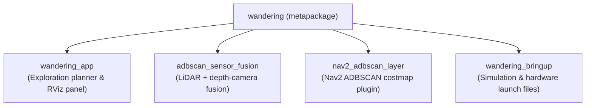

<!--
Copyright (C) 2026 Intel Corporation

SPDX-License-Identifier: Apache-2.0
-->

# `wandering` (Metapackage)

`wandering` is the top-level ROS 2 metapackage for the `wandering` application
stack. It groups and coordinates runtime dependencies across the perception,
costmap, exploration, and bringup packages in this workspace.

Installing or declaring an execution dependency on `wandering` pulls in the complete
suite of components required to run autonomous exploration with ADBSCAN-enhanced
Nav2 navigation.

## Metapackage dependencies

The metapackage specifies execution dependencies on all core packages within the
workspace:



| Package | Role | Description |
| :--- | :--- | :--- |
| `wandering_app` | Autonomous exploration | Frontier selection, costmap exploration planner, and RViz control panel. |
| `adbscan_sensor_fusion` | Perception fusion | Synchronizes 2D LiDAR and depth point clouds into unified 3D point clouds. |
| `nav2_adbscan_layer` | Navigation costmaps | Nav2 `costmap_2d` plugin that marks ADBSCAN obstacle clusters into costmaps. |
| `wandering_bringup` | Platform orchestration | Hardware bringup (Clearpath Jackal) and Gazebo simulation environments. |

## Package contents and structure

```
wandering_metapackage/
├── CMakeLists.txt
├── package.xml
├── jazzy/
│   └── debian/changelog
└── humble/
    └── debian/changelog
```

## Building and packaging

### Building the full workspace

Build the metapackage along with all runtime dependencies:

```bash
colcon build --packages-up-to wandering --symlink-install
```

### Debian packaging

The metapackage generates the binary package `ros-${ROS_DISTRO}-wandering`, which depends
on the corresponding Debian packages for all four component packages:

```bash
make package
```
